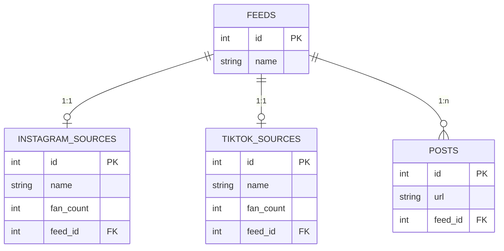

<!-- source ./venv/bin/activate -->
### Setup the project 
Create a MySQL server:
```
docker-compose up
```
Install the required dependencies:
```
pip install -r requirements.txt
```

### Docs
<code>connect</code> - Connects with a MySQL server.
<ul>
    <li><code>--user</code> - Database user.</li>
    <li><code>--password</code> - Database password.</li>
    <li><code>--host</code> - Database host.</li>
    <li><code>--port</code> - Database port.</li>
</ul>


<code>create</code> - Creates a new database in the MySQL server and executes the schema from any database.
<ul>
    <li><code>--db-name</code> - The name of the database to be created.</li>
    <li><code>--schema-from</code> - The name of the database that the schema will be imported.</li>
</ul>

<code>copy</code> - Copy entries and its relationed data based on the **feed_id** from the **broken_db** to the created database.
<ul>
    <li><code>--only</code> (optional) - Filters sources. only <code>instagram</code> and <code>tiktok</code> values accepted.</li>
    <li><code>--include-posts</code> (optional) - The number of posts will be copied.</li>
</ul>

<code>exit</code> - It makes you leaave the CLI.

### Running the cli and tests
Running the CLI:
```
python3 cli.py
```
Testing the CLI:
```
python3 test_cli.py
```

### Tutorial
```
connect --user=root --password=root --host=localhost --port=33066
```
```
create --db-name=recovery_db --schema-from=broken_db
```
```
copy 1
```

### Observe the changes
Go insisde the container:
```
docker-compose exec db sh 
```
Access the database:
```
mysql -h localhost -P 3306 --protocol=tcp -u root -p
Enter password: root
```
Create a query to se the feeds in the new database:
```
SELECT * FROM recovery_db.feeds;
```

### DB schema
